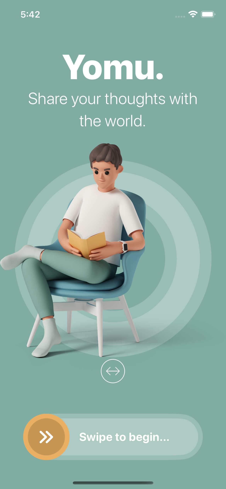

# Yomu-SwiftUI

## Overview of the App

### Yomu iOS App Summary

The Yomu iOS app offers a rich set of features designed to enhance the UI experience:

- **Home Screen with SwiftUI**: The app's home screen is built using SwiftUI, ensuring a modern and efficient user interface.

- **Horizontal Parallax Effect and Animation**: The app incorporates a horizontal parallax effect along with animated elements, providing a dynamic and visually engaging user experience.

- **App Storage Integration for Application Restart**: Yomu utilizes app storage capabilities to facilitate a seamless restart of the application on iPhones, ensuring continuity and user convenience.

- **Drag Gesture**: The app supports drag gestures, allowing users to interact intuitively with the interface and providing a responsive and interactive experience.

- **Rotation Effect**: Yomu employs a rotation effect to add a dynamic and engaging element to the user interface, enhancing the overall visual appeal.

- **UX Enhancement**: The app places a strong emphasis on enhancing the overall user experience through intuitive design, smooth animations, and interactive gestures.

- **Text Translation with Identifiable View**: Yomu incorporates text translation using identifiable views, allowing for seamless localization and ensuring accessibility for a global audience.

- **Dark Mode Optimization**: The app optimizes dark mode for different screens:
    - Main Screen: Ensures the notification bar is integrated seamlessly with dark mode, providing a consistent visual experience.
    - Second Screen: Adapts to different modes with aesthetic changes, offering a visually pleasing and comfortable reading environment.

- **AVFoundation Integration**: Yomu leverages AVFoundation to provide audio support, enhancing the app's capabilities for audiobook enthusiasts and offering a versatile reading experience.

- **Haptic Feedback**: The app incorporates haptic feedback to provide tactile responses to user interactions, creating a more engaging and responsive user interface.

Yomu iOS app combines cutting-edge design and functionality to deliver a premium UI experience, offering a seamless blend of innovative features, animation, and user-centered design principles. The integration of app storage, drag gestures, rotation effects, and localization ensures a comprehensive and enjoyable reading environment for users. Additionally, the inclusion of AVFoundation and haptic feedback further enriches the overall experience, making Yomu a standout iOS application for avid readers.

## Note

Yomu means "read" in Japanese

## Screenshots

